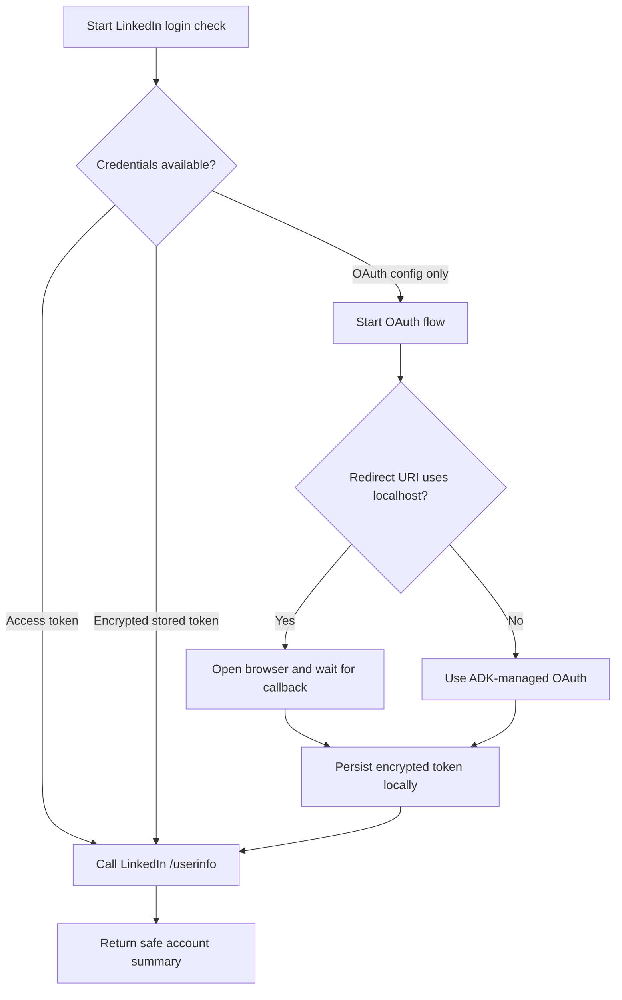
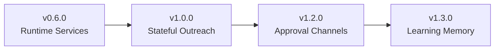

# LinkedIn Agent

An ADK-based LinkedIn assistant focused on profile visibility, engagement, and safe workflow automation.

## Overview

This project is being built in stages. Today, the repository provides a safe read-only LinkedIn foundation:

- LinkedIn OAuth 2.0 login
- OpenID Connect authentication
- read-only `/userinfo` verification
- localhost browser callback support with OAuth `state` validation
- encrypted local token storage for OAuth credential reuse
- environment-based configuration
- unit and integration coverage for the authentication path

It does **not** yet publish posts, send invitations, edit profiles, or automate external LinkedIn actions.

The current implementation is intentionally narrow. Its purpose is to confirm that:

- the LinkedIn OAuth configuration is valid
- the user can authenticate successfully
- the repository can safely call a read-only LinkedIn endpoint
- the agent can expose this capability through a small ADK tool surface

**Current LinkedIn library:** `linkedin-api-client`

## Current Flow

## Repository Structure

- `app/`: ADK app entry points and agent wiring
- `app/linkedin/`: LinkedIn OAuth and API helpers
- `app/tools/`: tool entry points exposed to the agent
- `tests/`: unit, integration, and eval coverage
- `openspec/`: proposals, specs, and implementation planning

## Configuration

Use `.env.example` as the starting point.

Relevant variables:

- `LINKEDIN_ACCESS_TOKEN`
- `LINKEDIN_CLIENT_ID`
- `LINKEDIN_CLIENT_SECRET`
- `LINKEDIN_REDIRECT_URI`
- `LINKEDIN_API_TEST_URL`
- `LINKEDIN_API_TIMEOUT_SECONDS`
- `LINKEDIN_OAUTH_SCOPES`
- `LINKEDIN_OAUTH_CALLBACK_TIMEOUT_SECONDS`
- `LINKEDIN_TOKEN_STORAGE_PATH`
- `LINKEDIN_TOKEN_ENCRYPTION_KEY`
- `LINKEDIN_PROFILE_STORAGE_PATH`
- `LINKEDIN_POST_STORAGE_PATH`

When `LINKEDIN_ACCESS_TOKEN` is not provided and you want the OAuth login flow to persist and reuse credentials, configure both secure token storage variables:

- `LINKEDIN_TOKEN_STORAGE_PATH`: local path for the encrypted token file
- `LINKEDIN_TOKEN_ENCRYPTION_KEY`: a Fernet key used to encrypt the file at rest

Optional encrypted local stores:

- `LINKEDIN_PROFILE_STORAGE_PATH`: local path for the encrypted member profile store
- `LINKEDIN_POST_STORAGE_PATH`: local path for the encrypted post metadata store

Generate a Fernet key locally with:

- `uv run python -c "from cryptography.fernet import Fernet; print(Fernet.generate_key().decode())"`

The repository stores only the minimum credential fields needed for reuse, keeps raw tokens out of tool responses, and clears invalid or rejected stored credentials before reauthorization.

When a stored LinkedIn access token expires, the local auth flow now behaves in three safe ways:

- if LinkedIn issued a usable refresh token, the agent refreshes the access token through the official token endpoint and continues without another consent prompt
- if no refresh token is available, the expired stored credential is cleared and the user is asked to authorize again
- if the refresh attempt fails transiently because of timeout, rate limiting, or another upstream issue, the agent returns a safe retry-later error without exposing secret values or forcing immediate reauthorization

## Local Verification

- `uv sync`
- `uv run pytest`
- `uv run python -c "import asyncio; from app.tools import run_linkedin_login_service; print(asyncio.run(run_linkedin_login_service()))"`
- `uv run python -c "from app.agent import root_agent; print([tool.__name__ for tool in root_agent.tools])"`

Optional live checks:

- `uv run pytest -m live tests/integration/test_linkedin_api_tool.py`
- `uv run pytest -m live tests/integration/test_linkedin_api_tool.py -q -rs`

## Product Principles

- Keep external LinkedIn actions explicit and reviewable.
- Prefer read-only validation before mutation.
- Require user approval before visible actions such as publishing, commenting, or outreach.
- Avoid undocumented endpoints, scraping, and bulk automation.

## Roadmap

Legend:

- [x] Completed
- [ ] Planned
- 🔒 Requires LinkedIn approval
- 🚫 Not supported by the public LinkedIn API

## Delivery Model

The roadmap is organized into two tracks:

- `Product releases`: user-facing capabilities delivered in sequence
- `Platform enablers`: internal runtime and state foundations required by later releases

Release tags MUST follow semantic versioning in the `vMAJOR.MINOR.PATCH` format. Planned roadmap milestones are written the same way, so the first authentication release is `v0.1.0`, not `v0.1`.

## Product Release Path

```mermaid
flowchart LR
    V010[v0.1.0<br/>Authentication] --> V020[v0.2.0<br/>Profile Data]
    V020 --> V030[v0.3.0<br/>Analytics]
    V030 --> V040[v0.4.0<br/>Publishing]
    V040 --> V050[v0.5.0<br/>Engagement Copilot]
    V050 --> V060[v0.6.0<br/>Runtime Services]
    V060 --> V100[v1.0.0<br/>Outreach]
    V100 --> V110[v1.1.0<br/>Filters]
    V110 --> V120[v1.2.0<br/>Automated Cards]
    V120 --> V130[v1.3.0<br/>Internal Learning]
    V130 --> V140[v1.4.0<br/>External Post Analysis]
```

## Platform Enablers

## Release Summary

| Version | Primary goal | Key deliverables | Depends on |
| --- | --- | --- | --- |
| `v0.1.0` | Establish safe LinkedIn authentication | OAuth login, OIDC, `/userinfo`, config, tests | None |
| `v0.2.0` | Build the authenticated identity layer | member URN, profile data, post metadata foundation | `v0.1.0` |
| `v0.3.0` | Measure profile and content performance | follower metrics, post analytics, comparisons | `v0.2.0` |
| `v0.4.0` | Enable controlled publishing | drafts, preview, publishing, scheduling | `v0.2.0`, `v0.3.0` |
| `v0.5.0` | Support post-level engagement | comment/reaction reading, reply suggestions, approval gates | `v0.4.0` |
| `v0.6.0` | Add runtime foundations | session service, memory service, persisted workflow state | `v0.1.0` |
| `v1.0.0` | Launch assisted outreach operations | connection targeting, approval queue, limits, history | `v0.5.0`, `v0.6.0` |
| `v1.1.0` | Add reusable audience segmentation | role/company filters, strategic audience selection | `v1.0.0` |
| `v1.2.0` | Automate recurring content generation | source-driven cards, approval workflow, traceability | `v0.4.0`, `v1.1.0` |
| `v1.3.0` | Learn from internal performance | growth memory, profile analysis, adaptive recommendations | `v0.3.0`, `v0.6.0`, `v1.2.0` |
| `v1.4.0` | Learn from external benchmark content | reference post analysis, pattern extraction, knowledge base | `v1.3.0` |

### v0.1.0 Authentication Foundation

Primary goal: safe authentication and account validation.

Release outcome: the agent can authenticate a user and validate read-only LinkedIn connectivity end to end.

- [x] OAuth 2.0 login, OpenID Connect, `/userinfo`, environment config, basic error handling, and tests
- [x] OAuth callback and state validation
- [x] Secure token storage
- [x] Token expiration handling

### v0.2.0 Profile Data

Primary goal: authenticated identity and base profile data.

Release outcome: the system can resolve the authenticated member identity and assemble a stable profile data foundation.

- [x] Retrieve available profile information
- [x] Build and store the authenticated member URN
- [x] Import user-supplied profile information
- [x] Read the authenticated member's posts 🔒
- [x] Store post metadata and handle unavailable posts

### v0.3.0 Analytics

Primary goal: profile and post performance measurement.

Release outcome: the product can quantify performance trends and compare content outcomes over time.

- [ ] Follower count and growth history 🔒
- [ ] Post analytics, engagement summary, and comparisons 🔒
- [ ] Reach, reactions, comments, reshares, and historical snapshots 🔒
- [ ] Basic profile completeness analysis and improvement suggestions

### v0.4.0 Publishing

Primary goal: controlled content creation and publication.

Release outcome: users can draft, preview, approve, and publish posts through a governed workflow.

- [ ] Local drafts and previews
- [ ] User approval before publishing
- [ ] Official API publishing and scheduling
- [ ] Retry, deduplication, and publication history

### v0.5.0 Engagement Copilot

Primary goal: high-quality engagement support around published content.

Release outcome: the product can assist with post engagement while keeping visible interactions user-approved.

- [ ] Read accessible comments and reactions
- [ ] Identify unanswered comments
- [ ] Suggest replies and reactions
- [ ] Require approval before visible engagement actions
- [ ] Reply through the official API

### v0.6.0 Runtime Services and Operational Foundation

Primary goal: runtime foundation for stateful automation and approval-driven workflows.

Release outcome: later automation features can rely on configured session and memory services plus persisted workflow state.

- [ ] Define `session service` through environment configuration
- [ ] Define `memory service` through environment configuration
- [ ] Select service types from `.env` for each deployment environment
- [ ] Establish persisted workflow state for approvals and retries
- [ ] Support operational history needed by later outreach and learning flows

### v1.0.0 Assisted Outreach and Engagement

Primary goal: guided outreach operations with limits and approvals.

Release outcome: the product can suggest and track controlled outreach actions with runtime-backed operational safety.

- [ ] Recommend targets and generate personalized connection messages
- [ ] Queue connection actions for approval
- [ ] Support daily and monthly connection limits
- [ ] Support a configurable comment limit, defaulting to `6`
- [ ] Generate contextual comments for other users' posts
- [ ] Store outreach/comment history and prevent duplicates

### v1.1.0 Advanced Filters and Audience Selection

Primary goal: reusable targeting and segmentation across workflows.

Release outcome: users can define audience filters once and apply them consistently to outreach and content workflows.

- [ ] Filters by role, company, industry, geography, and seniority
- [ ] Filters for major technology companies and strategic roles
- [ ] Reuse filters across connection, commenting, and publishing flows
- [ ] Save reusable filters
- [ ] Support Premium-related filters when the user provides the source data

### v1.2.0 Automated Cards and Approval Workflow

Primary goal: recurring card-style content generation from approved sources.

Release outcome: the system can generate repeatable content drafts from trusted sources and route them through approval before publication.

- [ ] Create automated card-style drafts
- [ ] Pull from approved recurring sources such as Google ADK documentation
- [ ] Generate daily or scheduled drafts
- [ ] Send every generated post for approval before publishing
- [ ] Support a planned WhatsApp-based approval flow or equivalent channel
- [ ] Store source-to-post traceability

### v1.3.0 Internal Learning, Memory, and Profile Analysis

Primary goal: adaptive recommendations based on internal performance and profile evolution.

Release outcome: the product can learn from the user's own history and improve future profile and content recommendations.

- [ ] Learn from the user's best-performing posts 🔒
- [ ] Identify high-engagement patterns 🔒
- [ ] Build reusable post playbooks
- [ ] Maintain a growth memory and adapt recommendations over time
- [ ] Analyze the user's current profile and generate profile improvement tools
- [ ] Turn learned patterns into future content recommendations

### v1.4.0 External Post Analysis and Knowledge Enrichment

Primary goal: external benchmark analysis to enrich the agent's content knowledge.

Release outcome: the system can extract useful patterns from external reference content and incorporate them into future recommendations.

- [ ] Analyze reference posts supplied by the user
- [ ] Extract structural, thematic, and CTA patterns
- [ ] Compare external patterns with the user's own content history
- [ ] Improve future content recommendations from external analysis
- [ ] Maintain a reusable knowledge base of observed post patterns

### Network Assistant Track

This is a cross-cutting capability track, not a separate release. It should be introduced progressively across `v1.0.0` and `v1.1.0`.

- [ ] Analyze a professional selected by the user
- [ ] Recommend `Follow`, `Connect`, or `No action`
- [ ] Generate a personalized connection message
- [ ] Keep invitation sending manual
- [ ] Track suggested manual actions

### Not Planned

- 🚫 People You May Know automation
- 🚫 Automatic bulk connection invitations
- 🚫 Maximum daily connection automation
- 🚫 Browser scraping
- 🚫 Private or undocumented LinkedIn endpoints
- 🚫 Guaranteed automation of LinkedIn Premium search filters
- 🚫 Automatic mass reactions
- 🚫 Generic automatic comments
- 🚫 Unrestricted access to the LinkedIn home feed

## Next Steps

- [x] Implement OAuth callback and state validation
- [x] Add secure persisted token handling
- [x] Add token expiration handling
- [ ] Build and store the authenticated member URN
- [ ] Add profile completeness analysis
